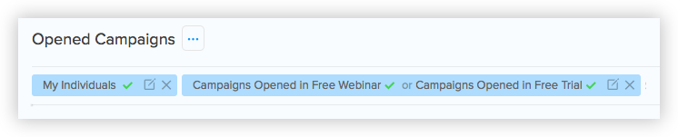

# Filter API

Filters allow you to segment your records within SalesSeek. You can use any field, including custom fields, as a value to filter against. 

<div class="wrap">
  <p class="flash info">
    Filters are designed to be applied to [groups]() to allow you to view records.
  </p>
</div>

<div class="wrap">
  <p class="flash info">
    The SalesSeek API does allow updating, deleting, or listing of filters. To update a filter, create a new filter with the amended values.
  </p>
</div>

<div class="wrap">
  <p class="flash warn">
  	Filters that are not associated with a group will be cleaned up periodically.
  </p>
</div>

## Filter Attributes

> The JSON encoded response for filtering individual records owned by 'Example User' that have opened either the 'Free Webinar' or 'Free Trial' email.

```json
{
	"id": "ef7e7b1c-a007-4eeb-aed8-c54657fddd8f",
  "filter_type": "individuals",
  "rules": [
    [
      {
        "field": "owner_id",
        "operator": "equal",
        "values": {
          "name": "Example Users",
          "id": "a938196a-152d-40f3-ab3d-804985143a4b"
        }
      }
    ],
    [
      {
        "field": "campaign_stats_open",
        "operator": "any",
        "values": {
          "campaign": {
            "name": "Free Webinar",
            "id": "41c4f28f-4e07-4cce-aaa8-0e2afac82577"
          }
        }
      },
      {
        "field": "campaign_stats_open",
        "operator": "any",
        "values": {
          "campaign": {
            "name": "Free Trial",
            "id": "774ed7f4-5c72-465a-82a2-5c47cf0db863"
          }
        }
      }
    ]
  ]
}
```

Parameter |  Description
--------- | ------- 
`id`      | The unique identifier for this filter **String**
`filter_type` | The type of records to be filtered (`indidivuals`, `opportunities`, `organizations`, `tasks`) **Enum (String)**
`rules` | Array containing rules used for this filter **Array**
`rules[x].field` | The name of the field that is used in this filter **String**
`rules[x].operator` | The operator used in this filter **String**
`rules[x].values` | Object containing the values used to apply to this filter **Object**
`rules[x].values.name` | Name of the values to be applied to this filter **Object**
`rules[x].values.id` | ID of the values to be applied to this filter **Object**

Filters can use `AND` and `OR` rules. `AND` rules are determined by the rule objects being in separate arrays in the `rules` array. `OR` values are multiple objects in the same array. 

The provided example would have the following appearance in the SalesSeek app.



## Get Filter

Returns the filter matching the `filter_id`

### Request URL

<span class='verb get'>GET</span> `https://{CLIENT_ID}.salesseek.net/api/{record_type}/filters/{filter_id}`

### Request Query Parameters

Parameter |  Description
--------- | ------- 
`record_type` | The record type that the filter applies to (individuals, organizations, opportunities, tasks) 
`filter_id` | The ID for the filter you'd like to retrieve


## Create Filter

Creates a new filter and then returns the newly created filter.

### Request URL

<span class='verb post'>POST</span> `https://{CLIENT_ID}.salesseek.net/api/{record_type}/filters/`


